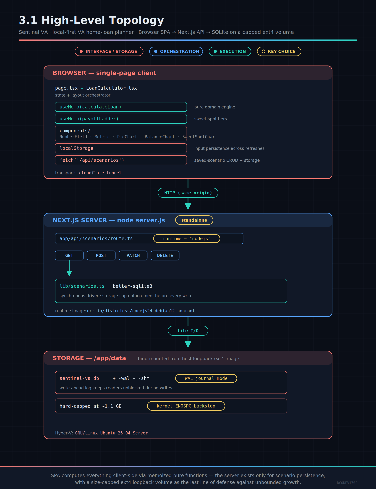

# Sentinel VA — Architecture & Design

> A comprehensive architecture and design reference for **Sentinel VA**, a
> local-first VA home-loan planning application. This document is derived from the
> codebase at version **0.7.1** and the full project CHANGELOG. It covers system
> architecture, the domain/calculation engine, data & persistence, the API surface,
> the UI component model, the design system, the build/runtime/deployment topology,
> operational procedures, and the security model.

---

## 1. Product overview

Sentinel VA is a **single-user, local-first financial planning workspace** for
prospective VA home-loan borrowers. It answers three questions at a glance:

1. **Payment** — what is the true monthly cost of this loan (P&I + escrow + HOA),
   including the VA funding fee?
2. **Affordability** — how does that payment sit against household income, VA-style
   residual-income requirements, and debt-to-income (DTI) ratios?
3. **Acceleration** — how much interest and time can extra-principal payments save,
   and where is the "sweet spot" between monthly strain and lifetime savings?

Design intent (see `DESIGN.md` for the token-level spec): a **monitor-first**, dark
Microsoft-blue/cyan dashboard with restrained neon data accents. It is explicitly a
**planning estimate, not an underwriting decision** — that disclaimer is a
first-class UI element and a design principle.

### 1.1 Guiding principles
- **Local-first, no account.** All data lives on the user's machine; there is no
  auth, no cloud, no telemetry. Scenarios persist in a local SQLite file.
- **Transparent math.** Every headline figure traces to a pure, unit-tested function
  in `src/lib/calculations.ts`. Nothing is a black box.
- **Bounded footprint.** Persisted storage is capped (app-level + kernel-level) so
  the data volume cannot grow without limit (§7).
- **Reproducible, hardened delivery.** Digest-pinned base image, non-root runtime,
  standalone build, two-layer storage cap, and a documented release SOP (§9).

---

## 2. Technology stack

| Layer            | Choice                          | Notes |
|------------------|---------------------------------|-------|
| Framework        | **Next.js 16.2.10** (App Router)| RSC + client islands; standalone output |
| UI runtime       | **React 19.2.4**                | Single client component tree |
| Language         | **TypeScript 5** (strict)       | End-to-end typed domain model |
| Persistence      | **better-sqlite3 12.x**         | Synchronous native SQLite driver |
| Styling          | CSS Modules + one globals.css   | No CSS framework; hand-authored tokens |
| Test runner      | **Vitest 4**                    | Pure-function unit tests |
| Lint             | **ESLint 9** + eslint-config-next | |
| Build base       | **node:24-bookworm-slim** (digest-pinned) | Debian/glibc; compiles the native module |
| Runtime image    | **gcr.io/distroless/nodejs24-debian12:nonroot** (digest-pinned) | Distroless: no shell/apt/npm/perl/tar |
| Runtime hardening | patched Node 24.18.0 overlay; nonroot uid 65532 | Minimal attack surface (see §9.3) |
| Container user   | nonroot **uid 65532**, `--cap-drop ALL`, `no-new-privileges` | |

The stack is deliberately small: a typed calculation core, a thin SQLite persistence
layer, one JSON API route, and a component-composed client UI.

---

## 3. System architecture




### 3.2 Request/data flow
1. **Compute path (no server):** All planning math runs **client-side** inside
   `LoanCalculator` via `useMemo`. Changing any input recomputes `calculateLoan`
   and `payoffLadder` synchronously — there is no server round-trip for the numbers.
2. **Persistence path (server):** Only **saved scenarios** touch the server. The
   client `fetch`es `/api/scenarios`; the route delegates to `lib/scenarios.ts`,
   which reads/writes the SQLite file and enforces the storage cap.
3. **Input persistence (browser):** Raw calculator inputs are mirrored to
   `localStorage` (post-hydration) so a refresh restores the working state without
   involving the database.

### 3.3 Module map (`src/`)

```
src/
├─ app/
│  ├─ layout.tsx              Root HTML shell + metadata; imports globals.css
│  ├─ page.tsx                Thin entry — renders <LoanCalculator/>
│  ├─ LoanCalculator.tsx      Client component: all state, layout, handlers
│  ├─ formatting.ts           usd formatter + shared display helpers
│  ├─ types.ts                UI-facing types (Scenario, Budget, Income, …)
│  ├─ globals.css             Font + base resets
│  ├─ loan-calculator.module.css   The full component stylesheet (single module)
│  ├─ page.module.css
│  ├─ components/
│  │  ├─ NumberField.tsx      Labeled numeric input with prefix/suffix
│  │  ├─ Metric.tsx           Label/value pair with tone (good/warning/bad)
│  │  ├─ PieChart.tsx         Donut charts (income allocation, residual room)
│  │  ├─ BalanceChart.tsx     Baseline-vs-accelerated payoff line chart
│  │  └─ SweetSpotChart.tsx   Multi-tier acceleration comparison + table
│  └─ api/
│     └─ scenarios/route.ts   JSON CRUD API for saved scenarios + storage status
└─ lib/
   ├─ calculations.ts         PURE domain engine (no I/O) — the math core
   └─ scenarios.ts            SQLite persistence + storage-cap enforcement
```

**Separation of concerns is the central architectural rule:** `lib/calculations.ts`
is pure and side-effect-free (fully unit-testable, runs identically on client or
server); `lib/scenarios.ts` owns all I/O and is the only module that imports
`better-sqlite3`; `LoanCalculator.tsx` orchestrates state and composes presentational
components but contains no financial math itself.

---

## 4. Domain & calculation engine (`src/lib/calculations.ts`)

The engine is a set of **pure functions** over strongly-typed inputs. All monetary
math is rounded through a single `money()` helper
(`Math.round((v + Number.EPSILON) * 100) / 100`) to avoid float drift.

### 4.1 Core types
- **`LoanInputs`** — purchase price, down payment, rate, term, taxes, insurance, HOA,
  VA funding-fee exemption + prior-use flags, extra monthly principal, annual lump sum.
- **`AmortizationMonth`** — per-month `{ month, payment, principal, interest,
  extraPrincipal, balance }`.
- **`Schedule`** — `{ months, totalInterest, totalPaid, entries[] }`.
- **`LoanResult`** — the full computed dashboard model (see §4.5).
- **`LadderRung`** — one acceleration tier `{ extraMonthly, months, totalInterest,
  interestSaved, monthsSaved, entries[] }`.

### 4.2 VA funding fee — `getFundingFeeRate()`
Implements the VA purchase/construction funding-fee table **effective 2023-04-07**
(cited inline with the official VA URL):
- Exempt → 0%.
- Down payment ≥ 10% → 1.25%; ≥ 5% → 1.50% (same for first and subsequent use).
- < 5% → 2.15% (first use) or 3.30% (subsequent use).

The fee is computed on the base loan and **financed into** the loan
(`financedLoan = baseLoan + fundingFee`), matching real VA practice.

### 4.3 Payment — `monthlyPayment()`
Standard amortized payment formula
`P·r(1+r)^n / ((1+r)^n − 1)` with a zero-rate fallback (`P/n`) and guards for
non-positive principal/term.

### 4.4 Amortization — `buildSchedule()`
Month-by-month simulation that:
- accrues interest on the running balance,
- applies the scheduled payment (clamped so it never overshoots the payoff),
- applies **extra monthly principal** and an optional **annual lump sum** (every 12th
  month), each clamped to the remaining balance,
- terminates when the balance is effectively zero (`≤ 0.005`) with a hard iteration
  guard (`month < months + 600`) to prevent runaway loops on pathological inputs.

Returns the full entry list plus `months`, `totalInterest`, `totalPaid`.

### 4.5 Aggregate — `calculateLoan()`
Composes the above into a `LoanResult`: base loan → funding fee → financed loan →
P&I → escrow/HOA → **total monthly payment**, then builds both the **baseline** and
**accelerated** schedules, and derives **interest saved**, **months saved**, and a
per-year `annualSavings` breakdown (baseline vs accelerated interest and balances).

### 4.6 Sweet-spot ladder — `payoffLadder()`
Runs the same financed loan across an array of extra-payment tiers. The baseline
(extra = 0) is computed once and anchors `interestSaved`/`monthsSaved` for every
rung. In the UI the tier set is
`[0, 1000, 1500, 2000, 2500, <user's current extra>]`, de-duplicated and sorted.

### 4.7 Chart sampling — `semiannualBalanceTimeline()`
Down-samples an amortization schedule to six-month points on a **linear
calendar-year axis** beginning 2026, tagging year-start vs mid-year so the payoff
and sweet-spot charts share identical time scaling.

### 4.8 DTI status — `dtiStatus()`
Thresholds: ≤ 41% good, ≤ 46% warning, otherwise bad — surfaced as tone colors.

---

## 5. Persistence layer (`src/lib/scenarios.ts`)

The **only** module that performs I/O. Uses `better-sqlite3` (synchronous) with WAL
journal mode. The database lives at `path.join(process.cwd(), "data",
"sentinel-va.db")` → `/app/data/sentinel-va.db` in the container (cwd is `/app`
under `node server.js`).

### 5.1 Schema
```sql
CREATE TABLE IF NOT EXISTS scenarios (
  id         INTEGER PRIMARY KEY AUTOINCREMENT,
  name       TEXT NOT NULL,
  payload    TEXT NOT NULL,               -- JSON-serialized calculator state
  created_at TEXT NOT NULL DEFAULT CURRENT_TIMESTAMP
);
```
Scenarios store the entire calculator state (`loan`, `incomes`, `budgets`,
`childcare`, `state`, `householdSize`) as a JSON blob in `payload`.

### 5.2 Operations
- `listScenarios()` — newest 30, JSON-parsed.
- `createScenario(name, payload)` — **enforces the storage cap first** (§7), then
  inserts and returns the row.
- `renameScenario(id, name)` / `deleteScenario(id)` — UPDATE / DELETE by id.

### 5.3 Storage accounting
- `STORAGE_LIMIT_BYTES` — 1 GB default, overridable via env (used to force the
  full-state in tests).
- `dataDirBytes()` — sums the size of every file in the data dir (db + WAL + SHM) so
  the measured footprint reflects the real volume, not just the main db file.
- `storageStatus()` → `{ bytesUsed, limitBytes, full }`.
- `StorageFullError` — thrown by `createScenario` at/over the limit.

---

## 6. API surface (`src/app/api/scenarios/route.ts`)

A single Next.js route handler, `runtime = "nodejs"` (required — native module).

| Method | Purpose            | Success | Notable failure |
|--------|--------------------|---------|-----------------|
| GET    | list + storage     | 200 `{ scenarios, storage }` | — |
| POST   | create scenario    | 201 `{ scenario, storage }`  | **507** `{ error, storage }` when full |
| PATCH  | rename scenario    | 200 `{ scenario }`           | 404 not found / 400 bad body |
| DELETE | delete scenario    | 200 `{ deleted }`            | 404 not found |

**Storage-full contract:** POST catches `StorageFullError` and returns **HTTP 507
Insufficient Storage** with a human message and current `storage` status. GET always
includes `storage` so the client can surface the banner proactively on load, not just
after a rejected save.

---

## 7. Storage cap — two-layer design

A deliberate **defense-in-depth** bound on the persisted volume so it can never grow
unbounded on the host.

### 7.1 Layer 1 — application-level (friendly)
`createScenario` refuses new writes once `dataDirBytes() ≥ STORAGE_LIMIT_BYTES`
(1 GB). The API returns 507 and the UI shows a **red banner with yellow text**
(`.storageBanner`, `role="alert"`) instructing the user to delete scenarios. This
layer trips **first** and gives a graceful, actionable message.

### 7.2 Layer 2 — kernel-level (hard backstop)
`/app/data` is bind-mounted from a **fixed-size loopback ext4 image**
(`~/.sentinel-data.img`, ~1.1 GB) on the host, created by
`~/.hermes/scripts/setup-data-volume.sh` (fallocate → `mkfs.ext4` → `mount -o loop`
→ data migration → `/etc/fstab` `loop,rw,nofail` for reboot persistence). Writes past
~1.1 GB get a true kernel **ENOSPC**. Sized slightly above the 1 GB app cap so the
friendly limit always fires first; the loopback is the last-resort ceiling.

### 7.3 Why not `--storage-opt size=`
Not viable on this host: (a) it requires XFS+pquota (or btrfs/zfs/devicemapper) — the
host is overlayfs over ext4; and (b) it caps a container's **writable layer only**,
never a bind mount. Since the data dir is a bind mount, the loopback image is the
correct hard-cap mechanism. **Resize** = unmount, recreate the image at a new size,
re-migrate.

---

## 8. UI architecture & design system

### 8.1 Component model
`LoanCalculator.tsx` is the single stateful client component; everything under
`components/` is presentational and receives data via props:
- **NumberField** — labeled numeric input (prefix/suffix), the primary input control.
- **Metric** — label/value pair with a `tone` (good/warning/bad) mapping to status
  colors; the atomic readout unit.
- **PieChart** — glossy donut charts with a center total, hover spotlight, and a
  glowing legend; used for income allocation and residual-income room.
- **BalanceChart** — baseline-vs-accelerated payoff line chart (amber baseline, neon
  green accelerated, each with a `drop-shadow` glow) on a semiannual calendar axis.
- **SweetSpotChart** — the acceleration-lab comparison: overlaid balance lines across
  tiers plus a table with columns *Extra / month · Total / mo · Payoff · Time saved ·
  Total interest paid · Interest saved*. The current plan is highlighted (★ + left
  accent).

### 8.2 Sweet-spot color system (value-based)
Tier colors are keyed to the **dollar amount**, not row position, so the palette is
stable as tiers or the user's current plan change:
`0 → amber, 1000 → cyan, 1500 → pink, 2000 → purple, 2500 → neon green`, with a
neutral gray fallback for any dynamic (user-current) tier. Each line's neon glow is
driven by `currentColor` (`drop-shadow(0 0 3px currentColor)`) so it matches its own
hue — mirroring the payoff chart above it.

### 8.3 Design tokens (`DESIGN.md`)
The visual language is captured as a machine-readable token spec in `DESIGN.md`:
- **Palette:** navy/black depth scale (`canvas #080C14` → `surfaceRaised #172235`),
  Microsoft blue (`#0078D4`) as the only default interaction color, cyan (`#42D9FF`)
  for live data/focus, green (`#36D399`) positive, amber (`#FBBF24`) near-threshold,
  rose (`#FB7185`) deficit/failure. **Status colors are never decorative.**
- **Typography:** IBM Plex Sans for prose/hierarchy, IBM Plex Mono for currency,
  ratios, labels, and table figures (tabular numerals for money).
- **Shape/spacing:** 14px panels, 8px controls, pill badges; 8px spacing rhythm.
- **Elevation:** color + thin border layering; a faint blue outer glow only on
  primary/focused elements; no glass blur, minimal shadow.

### 8.4 Interaction & accessibility
High-contrast, visible focus outlines (blue), motion < 180ms, labeled inputs, and the
storage banner uses `role="alert"`. The product deliberately labels every output as
**non-underwriting guidance** and never presents residual/DTI as an approval decision.

### 8.5 Client state
`LoanCalculator` holds loan inputs, incomes, budgets, childcare, state, household
size, saved-scenario list, selection, notice/toast, and `storageFull`. Derived
figures are `useMemo`'d. Inputs are hydrated from `localStorage` after mount (a
deferred-hydration pattern that eliminated React hydration warnings — see CHANGELOG
0.2.9) and re-persisted on change.

---

## 9. Build, runtime & deployment

### 9.1 Multi-stage Docker build (`Dockerfile`)
- **Build stage:** digest-pinned `node:24-bookworm-slim`; installs the C/C++
  toolchain (`python3 make g++`) **only here** to compile `better-sqlite3`; runs
  `next build` with `output: "standalone"`; and pre-creates `/app/data` owned by
  uid 65532 (the runtime has no shell to chown it later). Node 24 is chosen so the
  native-module ABI matches the distroless runtime family (distroless publishes
  nodejs22/nodejs24, not nodejs26).
- **Runtime stage:** a **distroless** base
  (`gcr.io/distroless/nodejs24-debian12:nonroot`, digest-pinned) — no shell, apt,
  dpkg, npm, perl, or tar. It copies the build stage's **patched `node` binary**
  (24.18.0) over distroless's older 24.14.0, then copies **only** the traced
  standalone bundle + `.next/static` + `public/` + the prepared `data/` dir (all
  `--chown=65532:65532`). ENTRYPOINT is already `["node"]`, so `CMD ["server.js"]`.
- **Result:** ~281 MB on-disk / ~112 MB image (down from ~1.26 GB pre-hardening),
  no OS package layer to speak of, native `.node` binary explicitly traced via
  `outputFileTracingIncludes`, and Docker Scout reporting no vulnerabilities.

### 9.2 Next.js standalone specifics
`next.config.ts` sets `output: "standalone"` and
`outputFileTracingIncludes: { "/**": ["./node_modules/better-sqlite3/build/Release/*.node"] }`
— file-tracing otherwise misses native binaries. `process.cwd()`-based DB path still
resolves to `/app/data` under the standalone server.

### 9.3 Runtime hardening & attack-surface reduction
The runtime is a **distroless image** — attack surface is minimized by *construction*
rather than by post-hoc purging:
- **No shell, no package manager (apt/dpkg), no npm/npx, no perl, no tar.** Whole
  CVE classes for those packages are simply absent (this is what eliminated the perl,
  npm/undici, and tar CVEs — including CVE-2025-45582 — that earlier Debian-based
  images had to purge or accept).
- **Nonroot by default (uid 65532).** Combined with `--cap-drop ALL` and
  `--security-opt no-new-privileges:true`. The live container runs `--user
  65532:65532`; the host data volume must be `chown`ed to 65532. Mirrored in
  `docker-compose.yml` (`user: "65532:65532"`).
- **Patched Node overlay.** Distroless lags the Node runtime (shipped 24.14.0), so
  the build base's patched `node` (24.18.0) is copied in — clearing node-runtime CVEs
  fixed in 24.14.1/24.17.0 (e.g. CVE-2026-21710, CVE-2026-21637). The binary's only
  dynamic deps (libstdc++/libm/libgcc_s/libc) already exist in distroless-debian12,
  so the drop-in is safe. Re-check the build-base Node version each release and keep
  the overlay current.

Each release is scanned (grype/Docker Scout) and the app is smoke-tested against the
distroless image (HTTP + DB write/read/delete + storage round-trip) using
`--user 65532:65532` and HTTP-only checks (no shell to exec into).

**Base-OS patch cadence (accepted trade-off):** distroless has **no apt**, so its
glibc/libssl packages cannot be patched in-image — they track Google's distroless
rebuild cadence rather than same-day Debian point releases. Updates are adopted
deliberately by bumping the pinned digest when a fresher distroless build lands
(Dependabot watches it — §9.4). This is the conscious cost of the far smaller,
shell-less, package-manager-less attack surface.

### 9.4 Supply-chain
Both base images are pinned by SHA-256 digest in every stage for reproducibility. A
Dependabot config (`.github/dependabot.yml`, `package-ecosystem: docker`) watches
**both** the `node:24-bookworm-slim` build base and the
`gcr.io/distroless/nodejs24-debian12` runtime base, opening a PR when either upstream
tag resolves to a new digest. **Policy:** these PRs are not merged directly
(Dependabot branches from an older commit and would revert newer work) — the digest
bump is reapplied onto fresh `main`, validated, released, and the PR closed. This is
how the Node 22→26 base bump (v0.6.0) was handled before the distroless migration.

### 9.5 Local run paths
- **Source:** `run.sh` (Node 20+, no Docker).
- **Prebuilt:** `docker run` of `digitalkali/sentinel-va:latest` (see `RUNNING.md`).

### 9.6 Public sharing — Cloudflare quick tunnel
The instance is exposed via a **cloudflared quick tunnel**
(`cloudflared tunnel --url http://localhost:3000`), giving an ephemeral
`*.trycloudflare.com` URL. The URL is bound to the live process; it changes if the
process restarts. A **daily rotation** (§10) intentionally churns it for hygiene.

---

## 10. Operational procedures (SOP)

The full release/operate routine is codified in the `docker-image-release` skill.
Summary:

1. **Implement** the change.
2. **Validate:** `npm run lint` + `npm run test` + `npm run build`; for UI/visual
   changes verify **computed styles in a real browser**; for native-module/DB or
   server-behavior changes **exercise the real code path** (write→read→delete, forced
   error states) against a throwaway container; **scan the built image with grype**
   and confirm zero `npm`/`undici`/`perl` findings.
3. **Version + CHANGELOG:** bump `package.json`, add a `[x.y.z]` entry.
4. **Commit + push** to `origin/main`.
5. **Rebuild + tag** `:X.Y.Z` and `:latest` (same digest) and **push both**.
6. **Redeploy** the live container on the new image with the identical hardened run
   config, republishing the **same host port** — **never touch cloudflared** (the
   quick-tunnel URL must stay stable between rotations).
7. **Remove the previous on-disk image** (`docker rmi <repo>:PREV`).

Steps 5–7 are skipped for changes that don't affect the built artifact (CI-config- or
docs-only) — stated explicitly when so.

### 10.1 Daily tunnel rotation
`~/.hermes/scripts/rotate-sentinel-tunnel.sh` runs at **03:00** (host is UTC = local)
via a `no_agent` cron job: kills the old quick tunnel → starts a fresh one → captures
the new `*.trycloudflare.com` URL → writes `~/sentinel-tunnel-url.txt` + a log →
sends the clickable URL to **Telegram** via `hermes send`; on failure it sends an
alert. The old link dies immediately at rotation. Process matching is restricted to
the real `cloudflared` executable (`/proc/<pid>/comm`) so a broad `pgrep -f` can't
kill unrelated processes. (Future: swap to a stable **named tunnel** for a permanent
URL — deferred for security/hygiene reasons.)

---

## 11. Security & privacy model

- **No auth, no accounts, no PII egress.** Everything is local; there is no user
  database, session, or third-party call in the app runtime.
- **Non-underwriting stance.** The app never renders an approval decision; residual
  and DTI are labeled planning heuristics.
- **Container hardening.** Distroless runtime — nonroot (uid 65532), all Linux
  capabilities dropped, `no-new-privileges`, digest-pinned base — with **no shell, no
  package manager, no toolchain, no npm/perl/tar, and no source**. Whole CVE classes
  are absent by construction. Each release is scanned (grype + Docker Scout); the
  current image reports no vulnerabilities. The distroless glibc/libssl patch cadence
  is an accepted trade-off (§9.3), adopted deliberately via pinned-digest bumps.
- **Bounded persistence.** Two-layer storage cap prevents a runaway or malicious
  write from filling the host disk.
- **Ephemeral exposure.** The public URL is a rotating quick tunnel, not a stable
  ingress — reducing the window any single shared link is valid.

---

## 12. Testing strategy

- **Vitest** unit tests target the pure engine (`calculations.test.ts`) and scenario
  logic (`scenarios.test.ts`): loan math, the VA funding-fee table across every
  down-payment tier and first-vs-subsequent use, amortization invariants, and the
  payoff-timeline axis invariants.
- **Release-time validation** additionally exercises the built image (run as
  `--user 65532:65532`, HTTP-only — the distroless image has no shell): HTTP health,
  a real DB write→read→delete round-trip (proves the native module is traced under
  standalone **and loads on the overlaid Node binary**), the storage-full 507 path
  (via `STORAGE_LIMIT_BYTES` override), the correct Node version on the overlay, a
  **grype / Docker Scout vulnerability scan**, and — for visual changes —
  computed-style inspection in a headless browser.

---

## 13. Evolution (from the CHANGELOG)

Sentinel VA grew from an initial local-first calculator (0.1.0) through: state
selector + affordability donuts + persistence (0.2.x), neon-pill UI + component
refactor (0.3.x), portable run + Docker Hub publish (0.4.0), the sweet-spot
acceleration lab (0.5.0–0.5.1), Docker hardening → non-root → digest-pin → devDep
prune → standalone (0.5.2–0.5.5), sweet-spot enhancements — Total/mo column, +$1,500
tier, value-based colors, neon glow (0.5.6–0.5.7), the 1 GB storage cap + banner
(0.5.8), an ARCHITECTURE.md + column-label clarity (0.5.9), the base-image upgrade to
Node 26 (0.6.0), CVE-driven attack-surface reduction — perl removal (0.6.1) and
npm/undici removal (0.6.2) — and finally the **distroless migration** (0.7.1): a
Node-24 distroless runtime with a patched-Node overlay that eliminated the shell,
package manager, perl, npm, and tar entirely, taking the image from ~1.26 GB to
~112 MB with a clean vulnerability scan. The trajectory is consistent: **transparent
math first, then progressively harden and bound the delivery**.

---

## 14. Quick reference

| Concern            | Location |
|--------------------|----------|
| Domain math (pure) | `src/lib/calculations.ts` |
| Persistence + cap  | `src/lib/scenarios.ts` |
| API                | `src/app/api/scenarios/route.ts` |
| State orchestrator | `src/app/LoanCalculator.tsx` |
| Charts             | `src/app/components/{BalanceChart,SweetSpotChart,PieChart}.tsx` |
| Design tokens      | `DESIGN.md` |
| Build/runtime      | `Dockerfile`, `next.config.ts`, `docker-compose.yml` |
| Storage backstop   | `~/.hermes/scripts/setup-data-volume.sh`, `/etc/fstab` |
| Tunnel rotation    | `~/.hermes/scripts/rotate-sentinel-tunnel.sh` (03:00 cron) |
| Release SOP        | `docker-image-release` skill |
