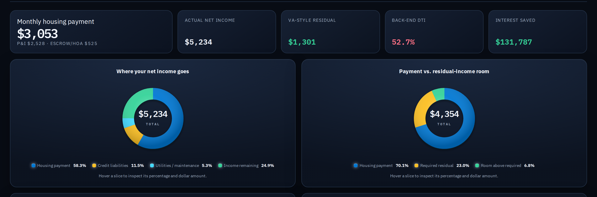
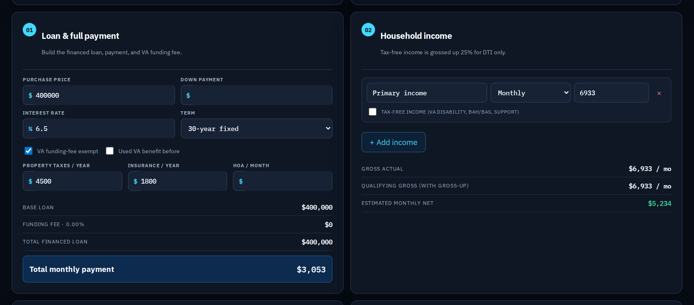
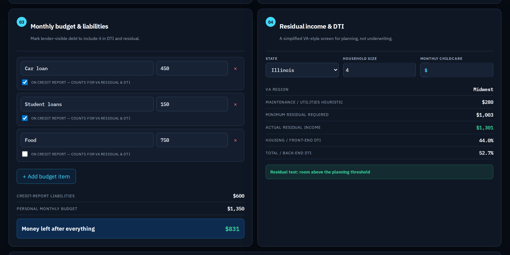
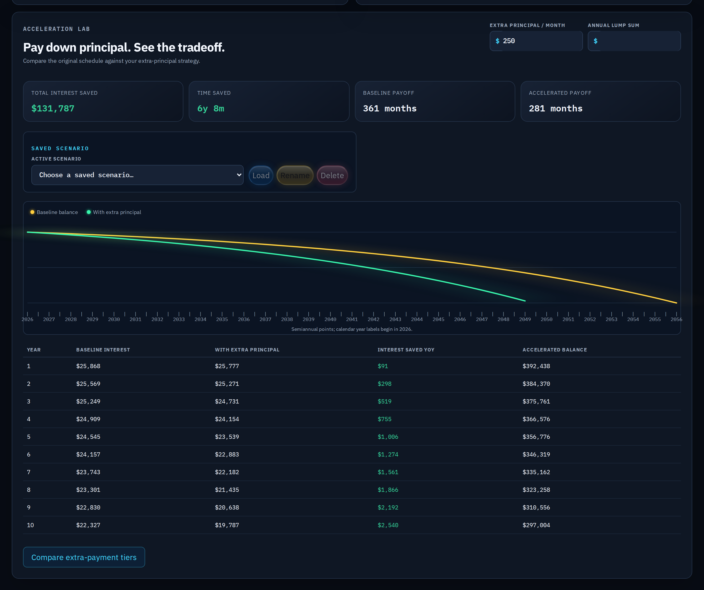
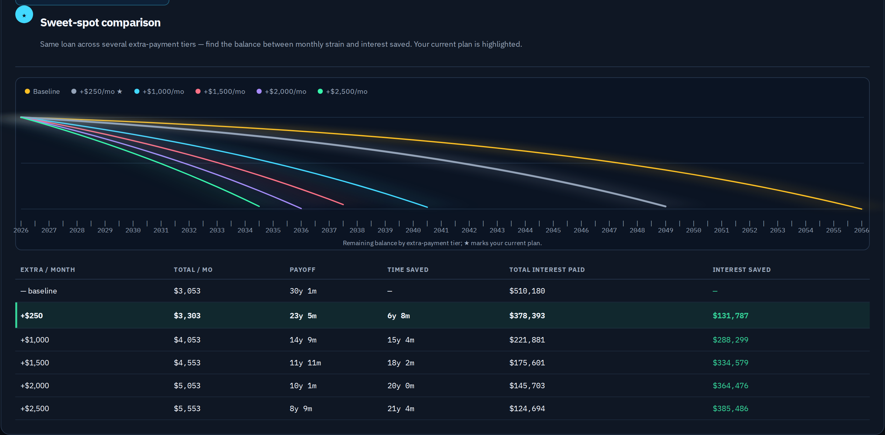

# Sentinel VA — Home Loan Calculator

A private, local-first VA home-loan planning workspace built with Next.js, TypeScript, and SQLite.

> **Planning tool only.** Sentinel VA is not a lender, VA eligibility decision, tax opinion, legal advice, or underwriting system. Confirm rates, VA funding-fee rules, residual-income requirements, and qualification details with a qualified lender and official VA resources.

## Highlights

- Calculates VA-style loan payment components: principal and interest, property taxes, insurance, HOA, and financed VA funding fees.
- Supports repeatable household income sources, including monthly, annual, hourly, and tax-free income for a planning-level DTI gross-up.
- Tracks household budget items, lender-visible liabilities, childcare, residual-income context, and front-/back-end DTI.
- Compares a baseline amortization schedule with extra monthly principal and annual lump-sum payoff strategies.
- Shows total interest saved, time saved, payoff horizon, remaining-balance graph, and year-over-year interest savings.
- Saves named calculation scenarios locally through a SQLite-backed API. No authentication is required.

## Application Tour

### Financial overview and affordability mix

The top-line view answers "can I afford this?" at a glance: total monthly housing payment, net income, VA-style residual, back-end DTI, and lifetime interest saved. The two donut charts break down where each dollar of net income goes and how the payment stacks up against the required residual-income cushion. Hovering any slice reveals its exact percentage and dollar amount.



### Loan setup and household income

This is where you build the scenario. The left panel assembles the financed loan — purchase price, down payment, rate, term, taxes, insurance, HOA, and the VA funding fee (with exemption and prior-use handling) — into a true total monthly payment. The right panel captures household income, including a 25% gross-up on tax-free income (VA disability, BAH/BAS) for DTI purposes only.



### Budget, liabilities, residual income, and DTI

Enter monthly obligations and flag which ones appear on your credit report so they count toward VA residual income and DTI. The right panel runs a simplified, state-aware VA residual-income screen — mapping your region, household size, and childcare against the minimum required residual — and reports both front-end and back-end DTI. It is explicitly a planning heuristic, not an underwriting decision.



### Extra-principal payoff strategy

The Acceleration Lab shows the payoff of paying down principal faster. Set an extra monthly amount (and optional annual lump sum) and the neon balance chart overlays your accelerated payoff against the original schedule, while the metrics call out total interest saved and years shaved off. The annual table breaks the savings down year by year, and scenarios can be saved locally for later comparison.



### Sweet-spot comparison

This view runs the same loan across several extra-payment tiers at once so you can find the balance between monthly strain and lifetime savings. Each tier is a distinctly colored line on the balance chart (your current plan highlighted), and the table lays out the trade-off precisely: total monthly out-of-pocket, payoff time, time saved, total interest paid, and interest saved for every tier. It turns "should I pay a little more each month?" into a side-by-side decision.



## Tech stack

- Next.js App Router
- React + TypeScript
- SQLite via `better-sqlite3`
- SVG balance-comparison visualization
- Vitest calculation tests

## Run locally

```bash
npm install
npm run dev
```

Open http://localhost:3000.

## Run as a portable app

To hand this to someone else to run on their own machine — from source or via Docker — see [RUNNING.md](RUNNING.md). One-command source launch:

```bash
./run.sh
```

## Run from Docker Hub

A prebuilt image is published at [`digitalkali/sentinel-va`](https://hub.docker.com/r/digitalkali/sentinel-va). No cloning or Node.js required — just Docker. The image is a hardened **distroless** build (no shell, package manager, perl, npm, or tar) that runs as the built-in nonroot user (uid 65532), so the host data directory must be owned by that uid:

```bash
mkdir -p data && sudo chown -R 65532:65532 data
docker run -d --user 65532:65532 --security-opt no-new-privileges:true --cap-drop ALL -p 3000:3000 -v "$(pwd)/data:/app/data" digitalkali/sentinel-va:latest
```

Open http://localhost:3000. The `-v` mount persists saved scenarios in `./data/` on the host between runs, while `--user`, `--security-opt`, and `--cap-drop` keep the app running with the same non-root hardening used by the compose file. Use `:latest` to always pull the newest build (the app and image are updated frequently).

## Share temporarily with Cloudflare Tunnel

For a short-lived public demo, run Sentinel VA locally or from Docker and confirm http://localhost:3000 opens on the host. Then start a quick Cloudflare Tunnel in a second terminal:

```bash
cloudflared tunnel --url http://localhost:3000
```

Cloudflare prints a temporary `https://...trycloudflare.com` URL that can be sent to someone else. The link stays available while the app/container, the host machine, and the `cloudflared` command are all still running. Stop sharing by pressing `Ctrl+C` in the tunnel terminal.

Treat the generated URL as public: anyone with the link can reach the app unless you add authentication in front of it. Avoid sharing personal saved scenarios or sensitive financial data through a temporary tunnel.

## Quality checks

```bash
npm run lint
npm test
npm run build
```

## Local data

Saved scenarios are stored in `data/sentinel-va.db` on the machine running the app. The `data/` directory is intentionally ignored by Git so personal financial scenarios are not committed.

## Project documents

- `PRODUCT_SPEC.md` — feature and engineering specification.
- `DESIGN.md` — visual-system tokens and UX rules.

## Operational resources

- [Cloudflare Tunnel quick tunnels](https://developers.cloudflare.com/cloudflare-one/connections/connect-networks/do-more-with-tunnels/trycloudflare/) - install `cloudflared` and create temporary `trycloudflare.com` URLs for local apps.

## Learning resources

Use these independent resources to understand VA loans, mortgage costs, and home-buying decisions:

- [VA home loan programs](https://www.va.gov/housing-assistance/home-loans/)
- [VA funding fees and closing costs](https://www.va.gov/housing-assistance/home-loans/funding-fee-and-closing-costs/)
- [VA loan limits](https://www.va.gov/housing-assistance/home-loans/loan-limits/)
- [Consumer Financial Protection Bureau: Owning a Home](https://www.consumerfinance.gov/owning-a-home/)
- [CFPB mortgage calculator](https://www.consumerfinance.gov/owning-a-home/explore-rates/)
- [Fannie Mae HomeView® homeownership course](https://www.fanniemae.com/education)
