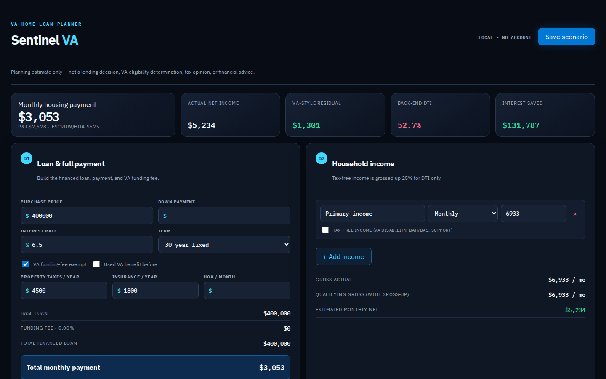

# Sentinel VA — Home Loan Calculator

A private, local-first VA home-loan planning workspace built with Next.js, TypeScript, and SQLite.

> **Planning tool only.** Sentinel VA is not a lender, VA eligibility decision, tax opinion, legal advice, or underwriting system. Confirm rates, VA funding-fee rules, residual-income requirements, and qualification details with a qualified lender and official VA resources.

## Highlights

- Calculates VA-style loan payment components: principal and interest, property taxes, insurance, HOA, and financed VA funding fees.
- Supports repeatable household income sources, including monthly, annual, hourly, and tax-free income for a planning-level DTI gross-up.
- Tracks household budget items, lender-visible liabilities, childcare, residual-income context, and front-/back-end DTI.
- Compares a baseline amortization schedule with extra monthly principal and annual lump-sum payoff strategies.
- Shows total interest saved, time saved, payoff horizon, remaining-balance graph, and year-over-year interest savings.
- Saves named calculation scenarios locally through a SQLite-backed API. No authentication is required.

## Screenshots

### Loan, payment, and household income



### Budget, liabilities, and VA-style residual-income context


### Extra-principal payoff analysis


## Tech stack

- Next.js App Router
- React + TypeScript
- SQLite via `better-sqlite3`
- SVG balance-comparison visualization
- Vitest calculation tests

## Run locally

```bash
npm install
npm run dev
```

Open http://localhost:3000.

## Quality checks

```bash
npm run lint
npm test
npm run build
```

## Local data

Saved scenarios are stored in `data/sentinel-va.db` on the machine running the app. The `data/` directory is intentionally ignored by Git so personal financial scenarios are not committed.

## Project documents

- `PRODUCT_SPEC.md` — feature and engineering specification.
- `DESIGN.md` — visual-system tokens and UX rules.
